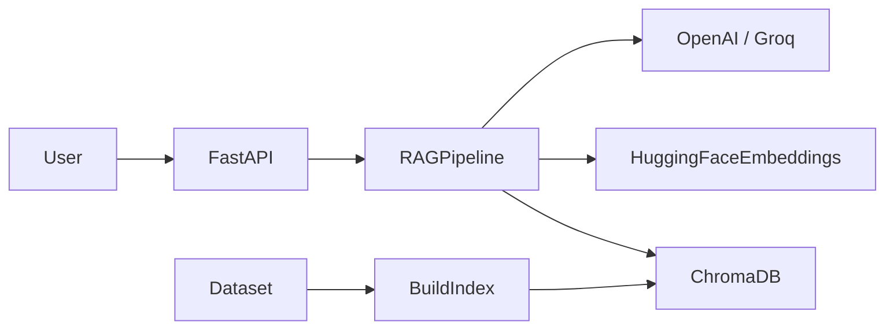

# Python Programming Q&A Assistant

RAG-powered API that answers Python programming questions for data science learners, grounded in Stack Overflow Python Q&A data.

## Architecture



**Stack**
- **Framework:** FastAPI
- **RAG:** LangChain (retrieval + prompt + LLM)
- **Embeddings:** `sentence-transformers/all-MiniLM-L6-v2` (local)
- **Vector store:** ChromaDB (persistent)
- **LLM:** OpenAI GPT-4o-mini or Groq Llama 3.3 (configurable)
- **Data:** Stack Overflow Python-tagged questions + top answers

## Prerequisites

- Python 3.11+
- Dataset in `DATASET/` (`Questions.csv`, `Answers.csv`, `Tags.csv`)
- OpenAI or Groq API key

## Setup

```bash
# 1. Create virtual environment
python -m venv .venv
.venv\Scripts\activate        # Windows
# source .venv/bin/activate   # macOS/Linux

# 2. Install dependencies
pip install -r requirements.txt

# 3. Configure environment
copy .env.example .env        # Windows
# cp .env.example .env        # macOS/Linux
# Edit .env and set OPENAI_API_KEY or GROQ_API_KEY

# 4. Build vector index (one-time, ~15–45 min depending on hardware)
python scripts/build_index.py
```

## Run API

```bash
uvicorn app.main:app --host 0.0.0.0 --port 8080
```

Interactive docs: http://localhost:8080/docs

## API Endpoints

### `GET /health`

Returns service status and configuration.

```json
{
  "status": "ok",
  "vector_store_ready": true,
  "llm_provider": "openai",
  "embedding_model": "sentence-transformers/all-MiniLM-L6-v2"
}
```

### `POST /ask`

**Request**
```json
{ "question": "How do I read a CSV file in pandas?" }
```

**Response**
```json
{
  "question": "How do I read a CSV file in pandas?",
  "answer": "...",
  "sources": [
    {
      "question_id": "12345",
      "title": "Read CSV with pandas",
      "score": 120,
      "excerpt": "..."
    }
  ]
}
```

## Testing

```bash
# Unit / integration tests
pytest tests/ -v

# Live RAG evaluation (requires API key + built index)
python scripts/run_test_queries.py
```

Results are written to `test_results.md` (10 diverse Python queries).

## Deployment

### Option A — Render / Railway

1. Build index locally: `python scripts/build_index.py`
2. Commit `data/vector_store/` or upload as build artifact
3. Set env vars from `.env.example`
4. Start command: `uvicorn app.main:app --host 0.0.0.0 --port $PORT`

### Option B — Docker

```bash
docker build -t python-qa-api .
docker run -p 8080:8080 --env-file .env python-qa-api
```

## Project Structure

```
├── app/
│   ├── main.py           # FastAPI application
│   ├── config.py         # Settings
│   ├── models.py         # Request/response schemas
│   ├── utils.py          # HTML stripping helpers
│   └── rag/
│       └── pipeline.py   # RAG chain
├── scripts/
│   ├── build_index.py    # Dataset → Chroma index
│   └── run_test_queries.py
├── tests/
│   └── test_api.py
├── DATASET/              # Stack Overflow CSVs (provided)
├── data/vector_store/    # Generated Chroma DB
├── test_results.md
├── requirements.txt
└── .env.example
```

## Design Decisions

1. **Python-tagged filter** — Only questions tagged `python` are indexed for relevance.
2. **Top-N by score** — Highest-voted questions (default 30k) keep index size manageable on free tiers.
3. **Best answer per question** — Highest-scored answer is paired with each question.
4. **Local embeddings** — Avoids embedding API cost; LLM is the only paid call.
5. **Grounded prompts** — System prompt instructs the model to use retrieved context and admit gaps.

## Scaling to 100+ Concurrent Users

See `slides/AI_Engineer_Assessment_Slides.md` for architecture, caching (Redis for query cache), async LLM calls, read replicas for Chroma/pgvector, connection pooling, and cost controls.

## Environment Variables

See `.env.example` for all options.
