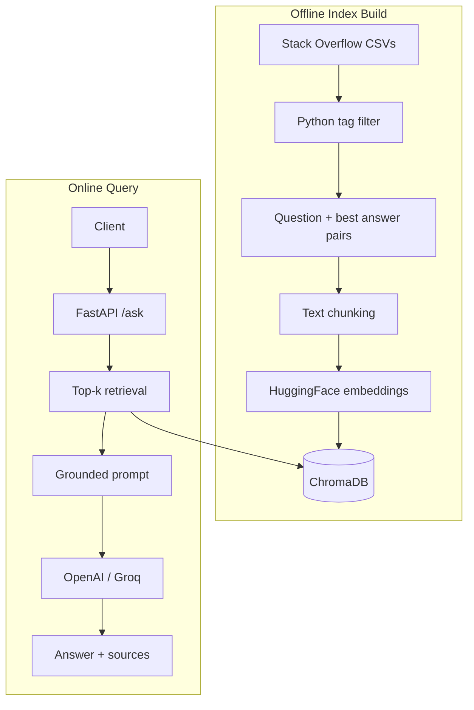

# Python Q&A Assistant — Slide Deck (10 slides)

---

## Slide 1 — Title

**Python Programming Q&A Assistant**

Analytics Vidhya — AI Engineer Assessment

RAG + FastAPI over Stack Overflow Python Q&A

---

## Slide 2 — Problem

Data science learners need **accurate, grounded** Python answers.

**Goal:** Build an AI assistant that answers Python questions using real Stack Overflow discussions — not hallucinated forum posts.

**Deliverables:** RAG pipeline, FastAPI (`/ask`, `/health`), tests, deployment-ready repo.

---

## Slide 3 — What We Built

| Component | Choice |
|-----------|--------|
| Ingestion | Filter `python` tags, top 30k questions by score |
| Embeddings | HuggingFace `all-MiniLM-L6-v2` (local) |
| Vector DB | ChromaDB (persistent) |
| Orchestration | LangChain retrieval chain |
| LLM | OpenAI GPT-4o-mini or Groq Llama 3.3 |
| API | FastAPI + Pydantic schemas |

---

## Slide 4 — Architecture

---

## Slide 5 — Key Design Decisions

1. **Python-only index** — Tags.csv filter improves precision for learner queries.
2. **Score-based sampling** — 30k highest-voted threads balance quality vs index size/cost.
3. **Local embeddings** — Zero embedding API cost; only LLM calls are paid.
4. **Source citations in response** — `sources[]` exposes question id, title, score, excerpt.
5. **Honest prompting** — Model instructed to admit when context is insufficient.

---

## Slide 6 — API Surface

**`GET /health`** — readiness, provider, embedding model

**`POST /ask`** — `{ "question": "..." }` → answer + retrieved sources

**Testing:** `pytest` for contract tests; `run_test_queries.py` for 10 live RAG evaluations documented in `test_results.md`.

---

## Slide 7 — Data Pipeline Details

- Strip HTML from SO bodies (BeautifulSoup)
- Pair each question with **highest-scored** answer
- Chunk: 1000 chars, 150 overlap
- Retrieve k=5 chunks per query
- Temperature 0.2 for factual stability

**Trade-off:** Large raw dataset (~15M questions) → pre-filter essential for laptop/free-tier deploy.

---

## Slide 8 — Quality Observations

**Strengths:** pandas, syntax, stdlib questions retrieve well.

**Watch areas:** decorators, `__str__` vs `__repr__`, environment-specific errors.

**Edge cases:** missing API key (500), no index (503), empty question (422), off-topic queries (prompt asks for honest limits).

---

## Slide 9 — Scaling to 100+ Concurrent Users

| Concern | Approach |
|---------|----------|
| Latency | Async FastAPI routes; async LLM client; connection pooling |
| Throughput | Horizontal pod autoscaling behind load balancer |
| Vector search | Migrate Chroma → **pgvector** / Qdrant cluster; shard by tag |
| Caching | Redis: cache (query embedding + answer) with TTL; cache popular questions |
| Cost | Smaller LLM for simple queries; batch embeddings offline only |
| Observability | Prometheus latency, retrieval hit rate, token usage per request |

---

## Slide 10 — Future Work

**Future:** Feedback loop (thumbs up/down → re-rank), hybrid search (BM25 + vectors), fine-tuned reranker, multi-turn chat memory.
